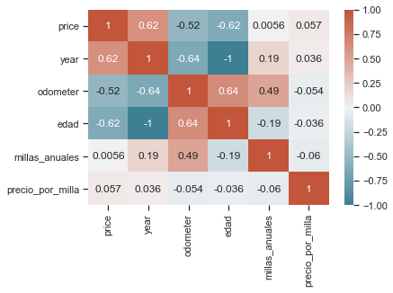
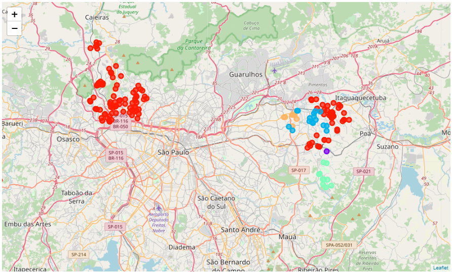

# MOB_Portfolio
Project portfolio from Matias Opazo B.

# [Project 1: Vehicles price estimator project](https://github.com/Mopazob/vehiculos_proy)

* Creates a model that estimates the vehicles prices in USA with MAE ~ $ 2.5k to help people to negotiate the price of some vehicle. 
* Used data from Kaggle platform.
* Cleaned, explained, visualize the data and then model building for predict price.
* Predictions by three models: Multiple Regression, Random Forest and K-nearest Neighbors Regression.

# [Project 2: Sao Paulo crimes, looking for the safest location for a comercial store](https://github.com/Mopazob/saopaulo_crimes) 

The focus of this project is to find a location for opening a safe comercial store in the city of Sao Paulo, Brazil. The report aims to different stakeholders interested in opening any business type. The first step will be to chose a safe borough, analysing the crimes and listing the amount of it committed per borough in Sao Paulo, where grocery stores are not amongst the most commom venues.

